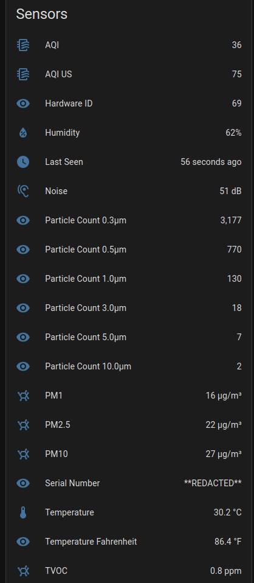

# Prana Air / AQI.IN Home Assistant Integration

A custom Home Assistant integration for **Prana Air air-quality monitors**.

This integration receives the data sent by the Prana Air device to AQI.IN and exposes the measurements as Home Assistant entities.

> **Note:** This is an unofficial custom integration and is not affiliated with or endorsed by Prana Air or AQI.IN.

## Features

- Receive Prana Air sensor data in Home Assistant
- AQI
- PM1
- PM2.5
- PM10
- Temperature
- Temperature Fahrenheit
- Humidity
- TVOC
- Particle counts
- Noise level
- Device serial number
- Hardware ID
- Last Seen timestamp
- All sensors grouped under a single Home Assistant device
- Optional forwarding of data back to AQI.IN
- Configure cloud forwarding through Home Assistant automations
- Use the sensor data in dashboards, automations, scripts, and templates

## How It Works

The Prana Air device normally sends data to:

```text
http://data.aqi.in/api/v1/SendSensordata
```

A local DNS rewrite can redirect `data.aqi.in` to a local machine running Nginx.

Nginx then forwards only the sensor endpoint to Home Assistant.

```text
Prana Air
    |
    | HTTP POST
    v
data.aqi.in
    |
    | Local DNS rewrite
    v
Nginx
    |
    | /api/v1/SendSensordata
    v
Home Assistant
```

This allows Home Assistant to receive the device data locally.

Cloud forwarding is optional and can be controlled by Home Assistant.

## Requirements

You need:

1. A compatible Prana Air device.
2. Home Assistant.
3. The Prana Air device and Home Assistant on the same local network.
4. A local DNS server that supports DNS rewrites.
5. Nginx or another HTTP reverse proxy.
6. Port `80` available for the proxy.

Example network layout:

```text
Prana Air:
192.168.50.100

Home Assistant:
192.168.50.10:8123

Nginx:
192.168.50.10:80
```

The addresses above are examples. Replace them with the addresses on your network.

## Installation

### Option 1: HACS

1. Open **HACS**.
2. Go to **Integrations**.
3. Open the menu.
4. Select **Custom repositories**.
5. Add this repository.
6. Select **Integration** as the repository type.
7. Install **Prana Air / AQI.IN**.
8. Restart Home Assistant.

### Option 2: Manual

Copy:

```text
custom_components/aqi_in
```

to:

```text
/config/custom_components/aqi_in
```

The directory should look like:

```text
/config/custom_components/aqi_in/
├── __init__.py
├── config_flow.py
├── const.py
├── coordinator.py
├── manifest.json
├── sensor.py
├── strings.json
└── translations/
    └── en.json
```

Restart Home Assistant after copying the files.

## Configure the DNS Rewrite

The Prana Air device must resolve:

```text
data.aqi.in
```

to the local machine running Nginx.

For example, in AdGuard Home create:

```text
data.aqi.in -> 192.168.50.10
```

Replace `192.168.50.10` with the IP address of your Nginx server.

You can verify the rewrite with:

```bash
nslookup data.aqi.in
```

The result should point to your local Nginx server.

## Configure Nginx

Nginx receives the HTTP request from the Prana Air device and forwards the sensor endpoint to Home Assistant.

Use:

```nginx
server {
    listen 80;
    server_name data.aqi.in;

    location = /api/v1/SendSensordata {
        proxy_pass http://192.168.50.10:8123;
    }

    location / {
        return 404;
    }
}
```

Replace:

```text
192.168.50.10
```

with your Home Assistant IP address.

The exact-match location means that only:

```text
/api/v1/SendSensordata
```

is forwarded to Home Assistant.

## Nginx Docker Setup

If you use Docker, the following stack can be used:

```yaml
version: "3.8"

services:
  aqi-proxy:
    image: nginx:alpine
    container_name: aqi-proxy
    restart: unless-stopped

    ports:
      - "80:80"

    command:
      - /bin/sh
      - -c
      - |
        cat > /etc/nginx/conf.d/default.conf <<'EOF'

        server {
            listen 80;
            server_name data.aqi.in;

            location = /api/v1/SendSensordata {
                proxy_pass http://192.168.50.10:8123;
            }

            location / {
                return 404;
            }
        }

        EOF

        nginx -g 'daemon off;'
```

Replace:

```text
192.168.50.10
```

with your Home Assistant IP.

Deploy the stack and verify:

```bash
docker ps --filter "name=aqi-proxy"
```

## Home Assistant Configuration

After installing the integration and configuring the DNS rewrite and Nginx proxy:

1. Restart Home Assistant.
2. Go to **Settings → Devices & services**.
3. Click **Add Integration**.
4. Search for **Prana Air / AQI.IN**.
5. Complete the setup.

Once the device sends its first request, the integration creates the corresponding entities.

## Sensor Entities

The integration supports the following sensor IDs:

| ID | Entity | Unit |
|---:|---|---|
| 1 | AQI | |
| 3 | PM2.5 | µg/m³ |
| 4 | PM10 | µg/m³ |
| 5 | PM1 | µg/m³ |
| 11 | Temperature | °C |
| 30 | Temperature Fahrenheit | °F |
| 12 | Humidity | % |
| 18 | TVOC | ppm |
| 71 | Particle Count 0.3 µm | |
| 72 | Particle Count 0.5 µm | |
| 73 | Particle Count 1.0 µm | |
| 74 | Particle Count 3.0 µm | |
| 75 | Particle Count 5.0 µm | |
| 76 | Particle Count 10.0 µm | |
| 13 | Noise | dB |

The integration also exposes:

- Serial Number
- Hardware ID
- Last Seen

All entities belonging to the same meter are grouped under one Home Assistant device.



## Device Data Format

The Prana Air device sends an HTTP POST request to:

```text
/api/v1/SendSensordata
```

with:

```text
Content-Type: application/x-www-form-urlencoded
```

The request body contains:

```text
jsonData=<JSON>
```

A typical payload has this structure:

```json
{
  "serialNo": "YOUR_DEVICE_SERIAL",
  "hwId": 69,
  "data": [
    [3, 18],
    [11, 27.9],
    [30, 82.3],
    [12, 71],
    [5, 12],
    [4, 21],
    [1, 30],
    [18, 0.016],
    [71, 2445],
    [72, 621],
    [73, 112],
    [74, 16],
    [75, 4],
    [76, 2],
    [13, 45]
  ]
}
```

Each item in `data` is:

```text
[sensor_id, value]
```

For example:

```text
[3, 18]
```

means:

```text
PM2.5 = 18
```


## Last Seen

The **Last Seen** entity shows when the most recent sensor request was received.

This can be used in Home Assistant to determine whether the Prana Air device is actively communicating.

## Optional AQI.IN Cloud Forwarding

The device does not need to send data directly to AQI.IN.

Home Assistant can forward the data instead.

The resulting flow is:

```text
Prana Air
    |
    v
Home Assistant
    |
    v
Home Assistant automation
    |
    v
AQI.IN
```

This allows Home Assistant to control when cloud uploads occur.

For example:

```text
Prana Air -> Home Assistant: every minute

Home Assistant -> AQI.IN: every 5 minutes
```

or:

```text
Prana Air -> Home Assistant: every minute

Home Assistant -> AQI.IN: disabled
```


## Privacy

With the DNS rewrite and local proxy configured, the Prana Air device sends its data to Home Assistant first.

```text
Prana Air
    |
    v
Local network
    |
    v
Home Assistant
```

Cloud forwarding is optional:

```text
Prana Air
    |
    v
Home Assistant
    |
    v
Optional AQI.IN
```

This allows the sensor data to remain local when cloud forwarding is not configured or is disabled.

## Troubleshooting

### No entities are created

Check that:

1. The integration is installed correctly.
2. Home Assistant has been restarted.
3. `data.aqi.in` resolves to your local proxy.
4. Nginx is running.
5. The Prana Air device can reach the proxy.
6. The device is sending requests.


### Test Home Assistant directly

You can test the endpoint without the physical device:

```bash
curl -v -X POST -H "Content-Type: application/x-www-form-urlencoded" --data 'jsonData={"serialNo":"TEST123","hwId":69,"data":[[3,19],[11,28.0]]}' http://192.168.50.10:8123/api/v1/SendSensordata
```

A successful request should return:

```text
HTTP/1.1 200 OK
```

and:

```text
OK
```

## Support and issues

If you encounter a bug, open an issue in this repository's **Issues** section and include:

- Home Assistant version
- Prana Air integration version
- Relevant Home Assistant log messages
- A description of the expected behavior
- A description of what actually happened

Do not include any private information in issue reports.


## Disclaimer

This project is an **unofficial Home Assistant integration for Prana Air air-quality monitors**.

It is not affiliated with, endorsed by, or supported by **Prana Air** or **AQI.IN**.

The integration relies on the HTTP communication used by the device. Future firmware or server changes may change the endpoint or payload format.

Use this project at your own risk.
